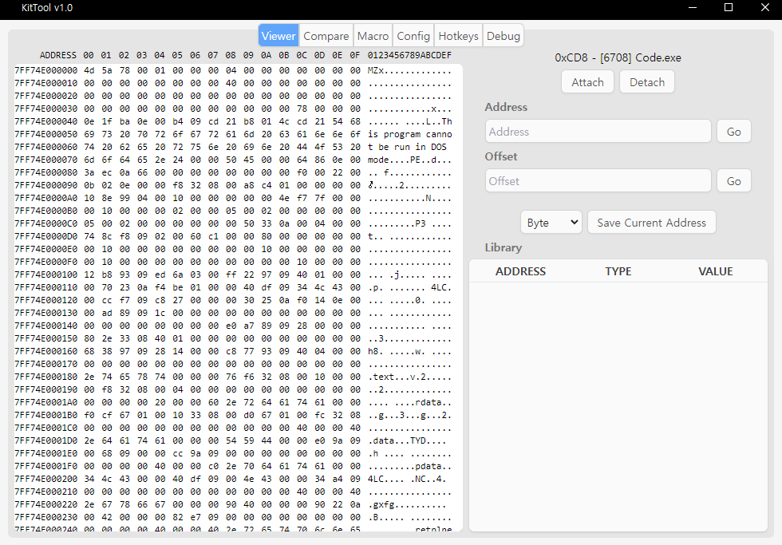
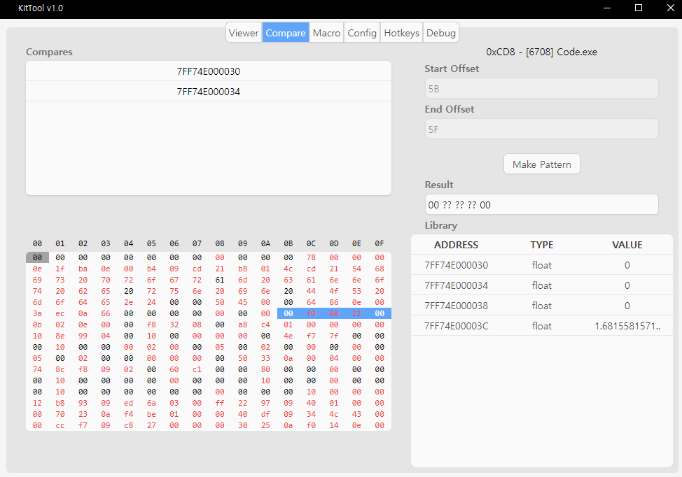
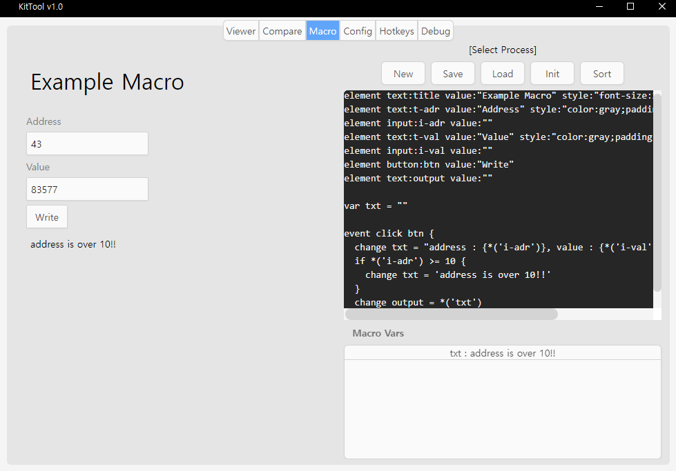

# KitTool
Memory Analyzing Tool

## About

|Base|Stack|Version|
|:---:|:---:|:---:|
|Platform|Electron|30.0.2
|Hooking|MemoryJs|3.4.0


## Run & Installation

Install :
```bash
npm i
```
Build :
```bash
npm run build
```
Run :
```bash
npm run start
```
Build Electron :
```bash
npm run build
```

## Features

### Viewer
- Attach to process
- Goto address by hexed number
- View the values as other value types
- Save address into library



### Compare
- Add addresses to comparing library from library
- Compare value from addresses each other
- Make pattern by selected range



### Macro
- Using 'Macro Script' to activate ([Goto Docs](#kts))
- Click 'Init' to activate macro
- Save as local file



## <div id="kts">Macro Script Docs</div>
### Element
- Define element in macro dom.
```kts
element [elementType]:[id] value:[value] style:[style]
```
|Key|Value|
|:---:|:---:|
|elementType|text \| input \| button|
|id|string|
|value|string|
|style|css string|
- Example :
```kts
element button:b-read value:"Read Value" style:"color:red;"
```
---
### Variable
- Define vars in macro.
- You can change var by 'change' command.
```kts
var [varName] = [value]
```
|Key|Value|
|:---:|:---:|
|varName|string|
|value|any|
- Example :
```kts
var addressOffset = 0x10

event click b-read {
  change addressOffset = 0x2A
}
```
---
### Event
- Add eventListener to global.
- You can write if conditions and commands in event.
```kts
event [eventType] [name?] {
  [commands or conditions]
}
```
- [name] doesn't need if eventType is loop.

|Key|Value|
|:---:|:---:|
|eventType|loop \| click \| init \| keydown \| keypress|
|name|var name \| element id|
- Example :
```kts
event loop {
  change count = *('count') + 1
}
```
### Evaluated Value
- You can use eval value in 'if conditions' or 'change, write commands'
- Eval value is like python's fstring.
- You can use {} to write non-string code.
- Example :
```kts
"Sum of one plus one is {1 + 1}"
```
- In non-string code, use modifier to transform value's type.
- Also you can use modifier in a row.

|Modifier|Result|
|:---:|:---:|
|s|string|
|n|number|
|b|boolean|
|x|toHexString|
|i|parseInt16|
|*|get value from var name or element id|
|1|read byte memory|
|4|read int32 memory|
|f|read float memory|
|d|read double memory|

- Example :
```kts
"Player Position : {fi('7FF74E000000')}, {f(0x7FF74E000A30)}"
# "Player Position : 43.618, 53.642"
```
```kts
x(0xA84B00)
# "a84b00"
```
```kts
s(n('30') + i('A')) + 22
# "4022"
```
---
### Commands
- Execute script handle.
- Only can write in event.
```kts
change [name] = [evalValue]
```
```kts
write [number] = [evalValue] as [valueType]
```
|Key|Value|
|:---:|:---:|
|name|var name or element id|
|evalValue|evaluated value|
|number|memory address|
|valueType|byte \| int \| float \| double|
- Example :
```kts
event click button {
  change var1 = "{s(0xA0 + 0x40)}00" # 1606400
  change var2 = n*('var1') + 125 # 1606525
}
```
```kts
event click write {
  write i('7FF74E00018C') = 9.5 as float
  write i*('address') + 0x20 = *('var2') as int
}
```
---
### If Conditions
- Check conditions to execute commands.
- Only can write in event.
```kts
if [evalValue] [condition statement] [evalValue] {
  [commands or conditions]
}
```
|Key|Value|
|:---:|:---:|
|condition statement|== \| != \| >= \| <= \| > \| \<|
|evalValue|evaluated value|
- Example :
```kts
event loop {
    if *('pin') == true {
        if n*('count') >= 20 {
            change textbox = 'counting is over!'
        }
    }
}
```